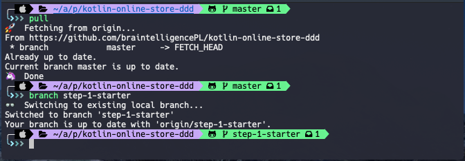
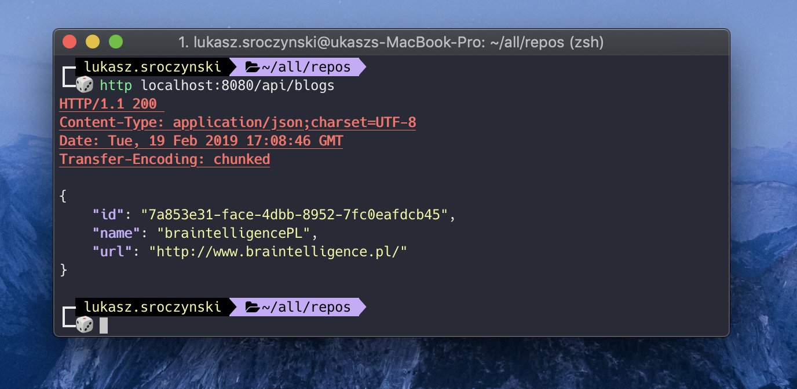
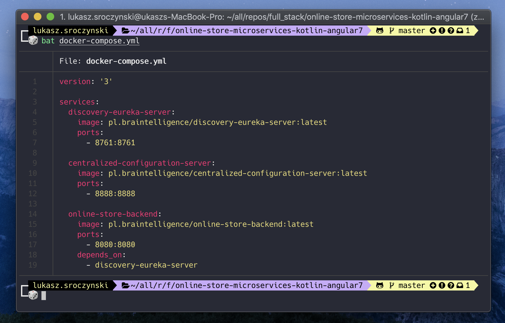
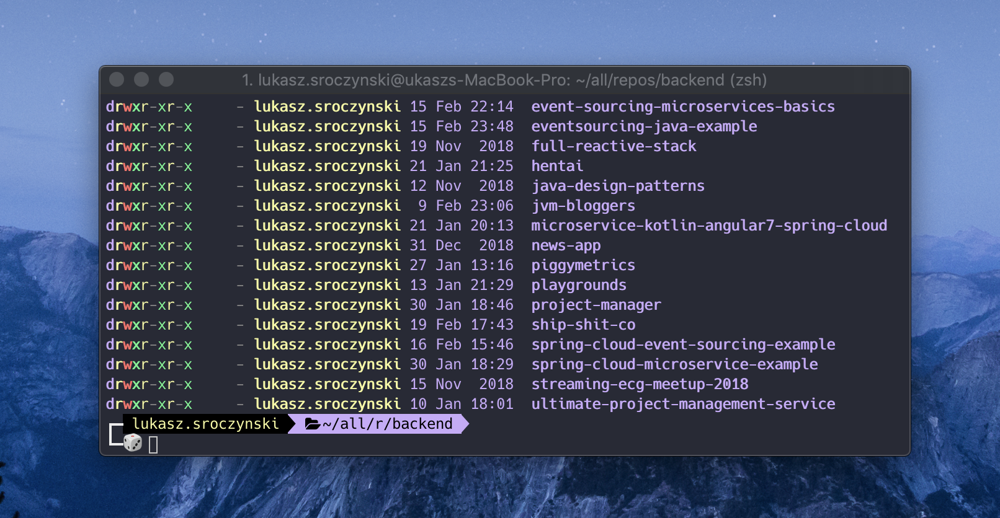

## `💻.macOS().ubuntu().build()`

That's what I use on daily basis. I used that configuration also on Ubuntu. Enjoy!

<BR>

### 🤔 Who's this setup is for? 
For anyone who uses terminal, does backend with JVM languages (Java, Kotlin, Scala). Does some Machine Learning/Deep Learning stuff. Occasionally some frontend with Angular, VueJS, ReactJS...

<BR>

### 🎲 Few essencial applications for productivity and convenience
- Anki - [`https://apps.ankiweb.net/`](https://apps.ankiweb.net/) - flashcards, so you remember everything!
- Evernote - [`https://evernote.com/download`](https://evernote.com/download) - for notes.
- Spotify - [`https://www.spotify.com/pl/download/mac/`](https://www.spotify.com/pl/download/mac/) - convinient store for playlists.
- Google Drive - [`https://www.google.com/drive/download/`](https://www.google.com/drive/download/) - drive for books, pdf, photos... etc.
- Docker - [`https://www.docker.com/get-started`](https://www.docker.com/get-started) 
- Toolbox JetBrains- [`https://www.jetbrains.com/toolbox-app/`](https://www.jetbrains.com/toolbox-app/)
- IntelliJ IDEA - [`https://www.jetbrains.com/idea/download`](https://www.jetbrains.com/idea/download)
- WebStorm [`https://www.jetbrains.com/webstorm/download`](https://www.jetbrains.com/webstorm/download)
- Visual Studio Code [`https://code.visualstudio.com/download`](https://code.visualstudio.com/download)
- Sublime - [`https://www.sublimetext.com/3`](https://www.sublimetext.com/3)
- Postman - [`https://www.getpostman.com/apps`](https://www.getpostman.com/apps)
- Robomongo - [`https://robomongo.org/download`](https://robomongo.org/download)

<BR>

### 🚛 Chrome Plugins
- `Ad-Block` - well... you know.
- `Stylus` - to change CSS style of any website that you want. (I don't even remember how white-github looks like)
- `Google Translate` - if you're not English speaker (very helpfull)
- `Postman Interceptor` - proxy to capture HTTP or HTTPS requests.
- `OneTab` - convert with one-click all of your tabs into a list.
- `Toby` - best tab manager that I used. Searching through the stuff is very powerful and convinient. 
- `WhatFont` - fast way of knowing what font are you looking at.
- `VueJs` - for VueJS developers.
- `Augury` - for Angular developers
- `Bitbucket Server Extension` - adder for configured bitbucket reviewers.
- `EmojiOne` - 🤓😎🤣

<BR>

### 🛠 Terminal tools
- `npm install --global fkill-cli` - kill processes with `fkill :8080` or launch the interactive UI `fkill`.
- `npm install --global alfred-fkill` - kill with alfred. 
- `brew install tree` - linux tree
- `brew install exa` - modern replacement for ls, tree
- `brew install httpie` - better curl `http POST :8010/products field1=asdf field2=1234`
- `brew tap moncho/dry && brew install dry` - Dry is terminal GUI for managing Docker and Docker Swarm.
- `brew install kotlin` - for kotlinc compiler.
- `brew tap caskroom/cask` & `brew cask install google-cloud-sdk` - gcloud CLI
- `brew install fzf` Command-Line Fuzzy Finder - better search CTRL + R with autosugestions and more!
- `git open .` - to open git repository in a browser. 
- [`git-friendly`](https://github.com/jamiew/git-friendly) - better git workflow. Just type pull, push, branch...
- `brew install tldr` - better man. Quick descriptions for popular commands.
- `brew install lazygit` - yet another tool for managing git.

<BR>

### 🔌 IntelliJ IDEA - plugins
- `Markdown`, `Kotlin`, `Scala`, `Docker` - self-explanatory
- `Maven Helper` - few shortcuts for running maven. Right-click and <b>run maven</b>
- `Rainbow Brackets` - colorful bracets
- `Gradianto` (Theme: Gradianto Deep Ocean) - much better syntax highlighting.
- `Material UI` - used for some time, but not anymore. Good for frontend stuff in my opinion. 
- `Lombok` - for java boilerplate.
- `Extra Icons` - few more icons.
- `SonarLint` - static analysis. 
- `TestMe` - auto generate unit tests in Java, Groovy or Scala. 
- `Presentation Assistant` - show shortcuts that you invoked.
- `Grep Console` - Grep, tail, filter, highlight... everything you need for a console.
<BR>
 
## 🛠 Macbook Apps 
- `Magnet` - workspace/window organizer
- `Dropover` - drag/drop files in finder (shake it!)
- `CopyClip 2` - clipboard manager 
- `Intellij Toolbox` - for managing jetbrains IDE
- `Docker desctop` - docker
- `f.lux` - eyes


## 🛠 Macbook Setup - Essentials
 
Current setup for terminal looks like that:



<br>

#### ⚙ brew - package manager 
* `/usr/bin/ruby -e "$(curl -fsSL https://raw.githubusercontent.com/Homebrew/install/master/install)"` <br>
* [`https://brew.sh/`](https://brew.sh/) <br> 

#### ⚙ iterm2 - much better terminal
* Theme for terminal (Dracula): [`https://draculatheme.com/iterm/`](https://draculatheme.com/iterm/) <br> 
* [`https://iterm2.com/`](https://iterm2.com/)

Setup: 
1. [`Natural Text Editing`](https://apple.stackexchange.com/questions/154292/iterm-going-one-word-backwards-and-forwards)

#### ⚙ zsh shell for terminal
* `brew install zsh` <br> 

#### ⚙ oh-my-zsh - for managing zsh
* `sh -c "$(curl -fsSL https://raw.github.com/robbyrussell/oh-my-zsh/master/tools/install.sh)"` <br>
* [`https://ohmyz.sh/`](https://ohmyz.sh/)

#### ⚙ PowerLevel9k for terminal customization (or newer PowerLevel10k)
* `git clone https://github.com/bhilburn/powerlevel9k.git ~/.oh-my-zsh/custom/themes/powerlevel9k` <br>
Read PowerLevel9k docs: [`https://github.com/bhilburn/powerlevel9k`](https://github.com/bhilburn/powerlevel9k) <br>
* `git clone https://github.com/romkatv/powerlevel10k.git $ZSH_CUSTOM/themes/powerlevel10k` <br>
Newer and faster version, PowerLevel10k: [`https://github.com/romkatv/powerlevel10k`](https://github.com/romkatv/powerlevel10k) <br>
(tests in progress - so far it works) 

#### ⚙ Nerd font - my favourite font 
[`nerd-fonts/hack/regular/complete`](https://github.com/ryanoasis/nerd-fonts/blob/master/patched-fonts/Hack/Regular/complete/Hack%20Regular%20Nerd%20Font%20Complete.ttf) <BR>

#### ⚙ plugins for zsh: 
* `git clone https://github.com/zsh-users/zsh-syntax-highlighting.git ${ZSH_CUSTOM:-~/.oh-my-zsh/custom}/plugins/zsh-syntax-highlighting`
* `git clone https://github.com/zsh-users/zsh-autosuggestions $ZSH_CUSTOM/plugins/zsh-autosuggestions`

<BR>

### ⚙ Few upgrades to common commands:

### Better docker
[https://github.com/moncho/dry](https://github.com/moncho/dry) and [tutorial about that](https://hackernoon.com/docker-cli-alternative-dry-5e0b0839b3b8)

#### ⚙ Better curl (httpie)
* `brew install httpie`



### ⚙ Better `bat` 🦇 than `cat` 😾
* `brew install bat`



### ⚙ Better ls (exa)
* `brew install exa`



Put configuration in `~/.zshrc`  file. Open with `nano ~/.zshrc` or `vim ~/.zshrc`.
```bash
export PATH=$HOME/bin:/usr/local/bin:$PATH
export ZSH="/Users/$USERNAME/.oh-my-zsh"

# ZSH_THEME="powerlevel9k/powerlevel9k"
ZSH_THEME="powerlevel10k/powerlevel10k"

POWERLEVEL9K_MODE="nerdfont-complete"
POWERLEVEL9K_DISABLE_RPROMPT=true
POWERLEVEL9K_PROMPT_ON_NEWLINE=true

POWERLEVEL9K_MULTILINE_LAST_PROMPT_PREFIX="%F{014}\u2570%F{cyan}\uF460%F{073}\uF460%F{109}\uF460%f "

POWERLEVEL9K_SHORTEN_DIR_LENGTH=1
POWERLEVEL9K_SHORTEN_DELIMITER=""
POWERLEVEL9K_SHORTEN_STRATEGY="truncate_from_right"

POWERLEVEL9K_LEFT_PROMPT_ELEMENTS=(os_icon dir vcs public_ip)


plugins=(
  git
  zsh-syntax-highlighting
  zsh-autosuggestions
  docker
)

# Jdk 8, 11, 14
alias setJdk8='export JAVA_HOME=$(/usr/libexec/java_home -v 1.8)'
alias setJdk11='export JAVA_HOME=$(/usr/libexec/java_home -v 11)'
alias setJdk14='export JAVA_HOME=$(/usr/libexec/java_home -v 14)'

# exa (better ls)
alias e='exa -all'
alias ee='exa --long --header -lgh'

# create cat from bat
alias cat='bat'

# better ls - exa
alias l1='exa --tree --level=1'
alias l2='exa --tree --level=2'
alias l3='exa --tree --level=3'
alias l4='exa --tree --level=4'
alias l5='exa --tree --level=5'
alias lx='exa -T'

alias clsdocker='docker stop $(docker ps -a -q) && docker rmi -f $(docker images -a -q) && docker rm -vf $(docker ps -a -q)'
alias w='~/all/repos/'

gch() {
  git checkout $(git branch --all | fzf)
}

source /etc/zprofile
```

<br>

## 🛠 Macbook Setup - most needed tools

### ⚙ JDK <br>
1. `brew update`
2. `brew tap caskroom/versions`
3. `brew cask install java`
4. `java -version` - to see what version of JDK you installed.
5. ```export JAVA_HOME="`/usr/libexec/java_home -v 1.8`"``` or `-v 11` depends on version you installed or use.
6. If you need install Java8 `brew tap caskroom/versions` and `brew cask install java8`
7. In `.zshrc` file you have aliases to switch between versions easily (just write setJdk8 in terminal).
(TIP re-load zsh typing `zsh` in your terminal or `source $ZSH/oh-my-zsh.sh`)

### ⚙ IntelliJ Idea - Setup 
[x] `Enable Annotation Processing` - set it as default (not only for specific project). <br> 
[x] `Create directories for empty content roots automatically` - depends if you want this to be automatic. <br>
[x] `Font to Fira Code, and enabling font ligatures` <br>

1. Install `Lombok` and `Kotlin` plugin.
2. Install `Spock Framework Enchancements` plugin - Spock live-templates. Example use: `spgwt`
3. Install [iterm-plugin](https://plugins.jetbrains.com/plugin/10344-iterm-plugin). Opens iterm from project path.
4. Create launcher script to open IDE from terminal.
Menu: `Tools -> CreateCommandLineLauncher` <br> 
From terminal: `idea .` inside of project. `idea /project` or just choose project to open.

### ⚙ Git
1. ` brew install git`
2. `git config --global user.name "your_name"`
3. `git config --global user.email "your_email@youremail.com"`

### Frontend (Angular, Node)
#### Visual Studio Code - plugins to install
* Save Typing
* IDE JetBrains Keymap
* Atom One Dark
* Auto Rename Tag
* Auto Close Tag
* Paste and indent
* Bracket Pair Colorizer
* Trailing spaces

#### Update npm: 
* `npm install -g npm`
#### Update AngularCLI: 
* `npm uninstall -g angular-cli @angular/cli`
* <del>`npm cache clean`</del> `npm cache verify`
* `npm install -g @angular/cli`
#### Sample Angular project: 
* `ng new first-frontend-app` - create project
* `yarn start` - start project
#### Install Node: 
* `brew install node`
* `npm update`
* `npm install -g node-gyp`


#### Can't build or run the project? Try these: 
* TIP-1: `ng update --all` - but be careful with that (good for new projects) 
