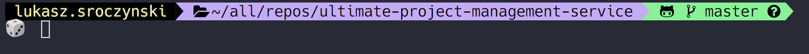

# 💻 Mac -> Macbook -> Mackintosh -> { setup }

(I used that configuration also on Ubuntu at work, so most important things work with Linux)

<BR>

### 🤔 Who this setup is for? 
For anyone who uses terminal, does backend with JVM languages (Java, Kotlin, Scala). Does some Machine Learning/Deep Learning stuff. Occasionally some frontend with Angular, ReacJS... or backend with NodeJS.

<BR>

### 🎲 Few applications for productivity and convenience
- Anki - [`https://apps.ankiweb.net/`](https://apps.ankiweb.net/) - flashcards, so you remember everything!
- Evernote - [`https://evernote.com/download`](https://evernote.com/download) - for notes.
- Spotify - [`https://www.spotify.com/pl/download/mac/`](https://www.spotify.com/pl/download/mac/) - convinient store for playlists.
- Google Drive - [`https://www.google.com/drive/download/`](https://www.google.com/drive/download/) - drive for books, pdf, photos... etc.
- Docker - [`https://www.docker.com/get-started`](https://www.docker.com/get-started) 
- IntelliJ IDEA - [`https://www.jetbrains.com/idea/download`](https://www.jetbrains.com/idea/download)
- WebStorm [`https://www.jetbrains.com/webstorm/download`](https://www.jetbrains.com/webstorm/download)
- Sublime - [`https://www.sublimetext.com/3`](https://www.sublimetext.com/3)
- Postman - [`https://www.getpostman.com/apps`](https://www.getpostman.com/apps)

<BR>

### 🚛 Chrome Plugins
- `Ad-Block` - well... you know.
- `Stylus` - to change CSS style of any website that you want. (I don't even remember how white-github looks like)
- `Google Translate` - if you're not English speaker (very helpfull)
- `Postman Interceptor` - proxy to capture HTTP or HTTPS requests.
- `OneTab` - convert with one-click all of your tabs into a list.
- `WhatFont` - fast way of knowing what font are you looking at.
- `VueJs` - for VueJS developers.
- `EmojiOne` - 🤓😎🤣

<BR>

## 🛠 Macbook Setup - Terminal


### ⚙ Package Manager - Brew
Brew: [`https://brew.sh/`](https://brew.sh/) <br>
Install : `/usr/bin/ruby -e "$(curl -fsSL https://raw.githubusercontent.com/Homebrew/install/master/install)"` <br>

### ⚙ Iterm 2 - much better terminal
Download and Install: [`https://iterm2.com/`](https://iterm2.com/)
Install Dracula Theme: [`https://draculatheme.com/iterm/`](https://draculatheme.com/iterm/)

### ⚙ Shell for terminal 
Fish has more out-of-box, but ZSH is a bit better, more things can be customized. 
I have sentiment for Fish because it was first thing that I used. 
Either way we gonna use ZSH.

ZSH: [`https://ohmyz.sh/`](https://ohmyz.sh/) <br>
Install : `sh -c "$(curl -fsSL https://raw.github.com/robbyrussell/oh-my-zsh/master/tools/install.sh)"` <br>

FISH: [`https://fishshell.com/`](https://fishshell.com/) <br>
Install : `brew install fish` <br>

### ⚙ Make ZSH shell even cooler! ⚡⚡
1. In home catalog `cd ~` you should have `.zshrc` file. Open that `nano ~/.zshrc` and read it. Next install powerlevel9k.
[`https://github.com/bhilburn/powerlevel9k`](https://github.com/bhilburn/powerlevel9k) <br>
* Install: `git clone https://github.com/bhilburn/powerlevel9k.git ~/.oh-my-zsh/custom/themes/powerlevel9k` <br>
* Install & Set: [`nerd-fonts/hack/regular/complete`](https://github.com/ryanoasis/nerd-fonts/blob/master/patched-fonts/Hack/Regular/complete/Hack%20Regular%20Nerd%20Font%20Complete.ttf)
* Install those
```bash
git clone https://github.com/zsh-users/zsh-syntax-highlighting.git ${ZSH_CUSTOM:-~/.oh-my-zsh/custom}/plugins/zsh-syntax-highlighting
git clone https://github.com/zsh-users/zsh-autosuggestions $ZSH_CUSTOM/plugins/zsh-autosuggestions
```

Put configuration in`.zshrc` file.
```bash
export PATH=$HOME/bin:/usr/local/bin:$PATH
export ZSH="/Users/$USERNAME/.oh-my-zsh"

ZSH_THEME="powerlevel9k/powerlevel9k"

POWERLEVEL9K_MODE="nerdfont-complete"
POWERLEVEL9K_DISABLE_RPROMPT=true
POWERLEVEL9K_PROMPT_ON_NEWLINE=true
POWERLEVEL9K_MULTILINE_LAST_PROMPT_PREFIX="┗━🎲 "
POWERLEVEL9K_MULTILINE_FIRST_PROMPT_PREFIX="┏━"

POWERLEVEL9K_LEFT_PROMPT_ELEMENTS=(user dir vcs)

plugins=(
  git
  zsh-syntax-highlighting
  zsh-autosuggestions
)

alias setJdk8='export JAVA_HOME=$(/usr/libexec/java_home -v 1.8)'
alias setJdk11='export JAVA_HOME=$(/usr/libexec/java_home -v 11)'

source $ZSH/oh-my-zsh.sh
```
## Cool features included:
- Switching easily between Java JDKs just write `setJdk8, setJdk11` to set your Java version.

<br>
<br>

## 🛠 Macbook Setup - most needed tools

### ⚙ JDK <br>
1. `brew update`
2. `brew tap caskroom/versions`
3. `brew cask install java`
4. `java -version` - to see what version of JDK you installed.
5. ```export JAVA_HOME="`/usr/libexec/java_home -v 1.8`"``` or `-v 11` depends on version you installed or use.
6. If you need install Java8 `brew tap caskroom/versions` and `brew cask install java8`
7. In `.zshrc` file you have aliases to switch between versions easily (just write setJdk8 in terminal).
(TIP re-load zsh typing `zsh` in your terminal or `source $ZSH/oh-my-zsh.sh`)

### ⚙ IntelliJ Idea - Setup 
1. [x] Enable Annotation Processing
2. Install `Lombok` plugin (even if you not use it. You'll eventually encounter project where it is used)

### ⚙ Git
1. ` brew install git`
2. `git config --global user.name "your_name"`
3. `git config --global user.email "your_email@youremail.com"`

### Frontend (Angular, Node)
1. `brew install node`
2. `npm update`
3. `brew install angular-cli`
4. `npm install -g node-gyp`

TIP 1: Can't build/run the project? <br>
Try: `ng update --all` inside of the project. <br>
